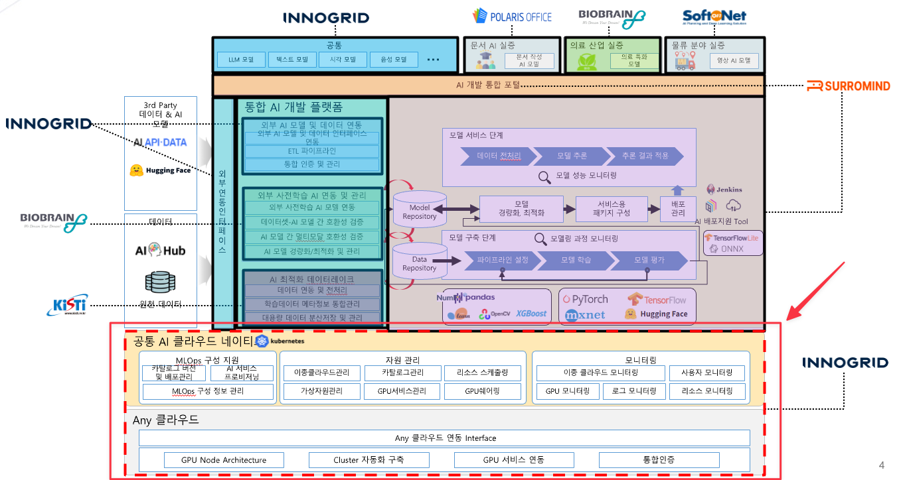
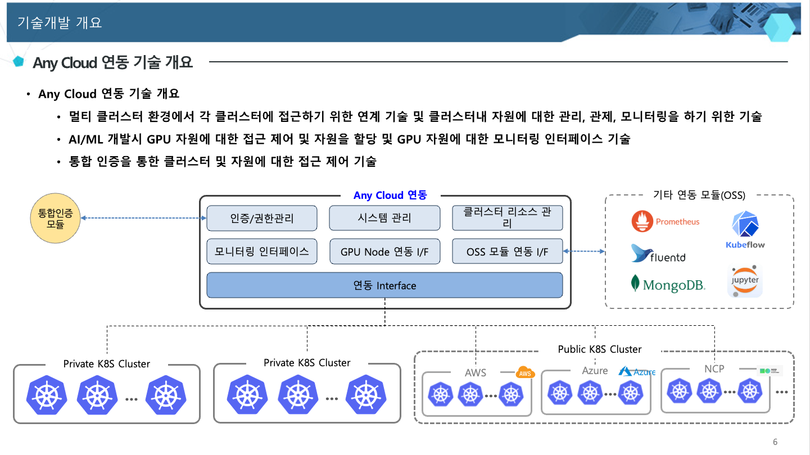
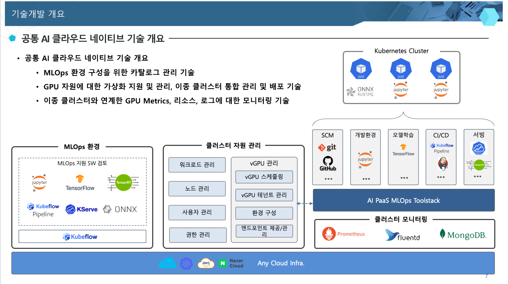

# any-cloud-management

멀티 클러스터 자원 관리, 관제, 모니터링을 위한 멀티 클라우드 관리 플랫폼





## 주요 특징

- **멀티 CSP 8종 지원**: AWS · GCP · Azure · Alibaba · OCI · DigitalOcean · OpenStack · Proxmox
- **VM → kubeadm 자동화**: Pulumi(Go) 가 VM/네트워크/보안/IAM 생성 → Bootstrap Worker 가 kubeadm init/join, CNI/Ingress/GPU Operator 설치 → 등록까지 한 번에
- **RabbitMQ 단계형 워크플로우**: `provision → bootstrap → verify → ready` (DLQ 포함), at-least-once 멱등성 가드 적용
- **Self-hosted 친화**: state backend RustFS(S3 호환), secrets OpenBao(Vault 호환). 외부 SaaS 의존 없음
- **운영용 기능**: Flyway 자동 마이그레이션, KubernetesClient 캐싱 (401/403 invalidate+retry), 도메인별 비동기 풀, 토큰 기반 인증 toggle
- **관측성**: 모든 워크플로우 메시지의 PROCESSED / SKIPPED_* / FAILED 결과를 `workflow_message_log` 에 영속화

## 빠른 시작 (로컬)

```bash
# 0. (한 번만) git pre-commit hook 등록 — Spotless / Buf lint 자동 검증
make hooks-install

# 1. 첫 setup — .env 자동 생성 + random secret 주입 + dev stack 기동
make bootstrap-dev          # ~3-5 min (cold), idempotent
# 또는 수동:
#   cp .env.sample .env  &&  편집
#   make dev-up              # docker-compose.dev.yml 의 full stack
#   make secrets-warn        # dev default 사용 여부 확인

# 2. OpenBao transit secrets engine 활성화 (secrets-provider=hashivault 사용 시)
docker compose -f docker-compose.dev.yml exec openbao bao secrets enable transit
docker compose -f docker-compose.dev.yml exec openbao bao write -f transit/keys/anycloud-pulumi

# 3. Swagger UI
open http://localhost:8888/docs

# 4. (선택) PoC 테스트 콘솔 — 4 탭 단일 페이지 (운영 포털은 별도)
open http://localhost:8888/test-console/index.html
```

기본 secrets-provider 는 `passphrase` (환경변수 `PULUMI_PASSPHRASE` 만 필요).
OpenBao 모드로 전환하려면 `PULUMI_SECRETS_PROVIDER=hashivault://openbao:8200/anycloud-pulumi` override.

> [`docs/README.md`](./docs/README.md) 문서 참고

## 빌드 / 검증 방법

| 명령 | 설명 | 소요 (cold / incremental) |
|---|---|---|
| `make backend-build` | Spring Boot 컴파일 | ~2 min / ~20 s |
| `make backend-test` | 전체 테스트 (unit + integration) | ~3-5 min / ~40 s |
| `make test-unit` | 단위 테스트만 (Testcontainers 미가동) | ~30 s |
| `make test-integration` | 통합 테스트만 (mariadb + rabbitmq) | ~3 min |
| `make test-coverage` | jacoco HTML 리포트 생성 + 자동 open | ~5 min |
| `make format` | `spotlessApply` — Palantir Java Format | ~5 s |
| `make format-check` | `spotlessCheck` — CI 동일 | ~5 s |
| `make proto-lint` | `buf lint` | ~2 s |
| `make pulumi-build` | Pulumi Go 빌드 | ~2 min / ~10 s |
| `make all-build` | backend + pulumi + agent | ~5 min |

## API 목록

모든 endpoint 는 `/v1/` prefix. 전체 표는 [`docs/api/v1-reference.md`](./docs/api/v1-reference.md) 참고.

| 도메인 | 경로 | 비고 |
|---|---|---|
| Providers (카탈로그) | `GET /v1/providers/{provider}/{regions, specs, images}` | 8 CSP 메타 실시간 조회 + Caffeine 30m cache |
| CSP Credential | `*/v1/credentials` | MANUAL(AES-GCM 암호화) / ENV (env 참조) |
| Cluster Preflight | `POST /v1/cluster-validations` | 생성 전 config/credential/name 검증 |
| Cluster (통합) | `*/v1/clusters` | VM 생성 + 외부 등록 (body source 분기), 202 LRO |
| Kubeconfig Import | `POST /v1/clusters:importKubeconfig?validate=&strict=` | 파일 업로드 → 자동 파싱 → 등록 + 연결성 검증 |
| K8s Resources | `*/v1/clusters/{c}/namespaces/{ns}/{kind}/{name}` | 통합 controller — cluster-scoped 도 동일 path 패턴 |
| Helm Releases | `*/v1/clusters/{c}/helm-releases/{r}` | install / upgrade / rollback / uninstall (LRO) |
| Helm Repos & Charts | `*/v1/helm-repos/{repoName}/charts/{chartName}` | repo CRUD + chart catalog |
| Operations (LRO) | `*/v1/operations/{operationId}` + `/events` (SSE) | 모든 비동기 작업의 단일 진실 소스 |
| Audit Logs | `GET /v1/audit-logs` | 자동 기록된 mutation 감사 로그 |
| Workflow (admin) | `GET /v1/workflow/queues` | RabbitMQ queue + DLQ 메시지 검색 |

응답 envelope: 성공은 `{success, status, message, data, meta?, links?}`, 에러는 `{code, status, message, errors[]}`.

### 운영 토글 (push 후 환경별 override)

| Property | Default | 효과 |
|---|---|---|
| `anycloud.audit.enabled` | true | M5: mutation 자동 audit log |
| `anycloud.idempotency.enabled` | true | M5: 24h Idempotency-Key cache |
| `anycloud.workflow.dlq-listener.enabled` | true | M8: DLQ 자동 consume + alert metric |
| `anycloud.http.insecure-tls` | false | C1: DEV ONLY — TLS 검증 우회 |
| `anycloud.helm.operation-timeout` | 5m | M7: helm install/upgrade/rollback timeout |
| `anycloud.cors.allowed-origins` | _(empty)_ | H6: production 명시 권장 |
| `csp-credential.encryption-key` | _(empty)_ | C4: MANUAL credential 사용 시 필수, fail-fast |

전체 property + Caffeine cache + ShedLock 표는 [`v1-reference.md` § 운영 properties](./docs/api/v1-reference.md#운영-properties-wave-1-4-신규).

## 문서

전체 문서 색인: [`docs/README.md`](./docs/README.md)

| 카테고리 | 내용 |
|---|---|
| [`docs/architecture/`](./docs/architecture/) | 시스템 설계, 런타임 구조, Pulumi / Starter / Design |
| [`docs/api/`](./docs/api/) | 외부 노출 API 명세 (v1 reference, webhook 등) |
| [`docs/conventions/`](./docs/conventions/) | 개발 표준 (DTO naming, DB migration, 주석 스타일, 용어) |
| [`docs/operations/`](./docs/operations/) | Quickstart, Day-2 운영, monitoring, E2E 체크리스트 |
| [`docs/runbooks/`](./docs/runbooks/) | 트러블슈팅 / 운영 절차 (cluster-agent 6종) |

## 구성

| 디렉터리 / 파일 | 설명 |
|---|---|
| `apps/anycloud/` | Spring Boot 백엔드 (Java 21) |
| `apps/agent/` | Cluster Agent (Go, in-cluster) |
| `libs/cluster-agent-spring-boot-starter/` | **Layer 1** — gRPC reverse-tunnel · 인증 · PodExec WebSocket |
| `libs/cluster-agent-features-spring-boot-starter/` | **Layer 2 통합** — RBAC + Backup + Observability sub-feature |
| `libs/cluster-provisioning-spring-boot-starter/` | 별도 — Pulumi CLI 위임 multi-CSP VM 인프라 orchestration |
| `infra/pulumi/` | Pulumi Go IaC, provider 별 sub-package |
| `infra/helm/` | Helm 차트 · binary 번들 |
| `infra/manifests/` | K8s manifest 예시 (gpu-observability, postgresql, kured) |
| `infra/docker/` | Dockerfile entrypoints · 빌드 보조 자산 |
| `proto/` | 공유 protobuf 스키마 (Java + Go generate) |
| `docker-compose.dev.yml` | MariaDB + RabbitMQ + ChartMuseum + RustFS + OpenBao + backend + worker 통합 dev compose (`make dev-up`) |
| `docker-compose.yml` | GHCR image pull 만 — production-like (`make prod-up`) |
| `Dockerfile.pulumi` | Pulumi CLI + Go 포함 backend 이미지 |
| `.bruno/` | API 통합 테스트 컬렉션 (Bruno) |
| `.github/workflows/` | GitHub Actions CI |
