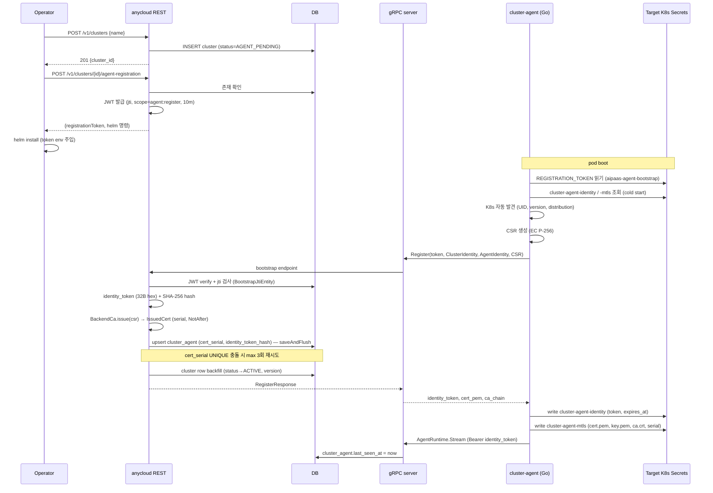
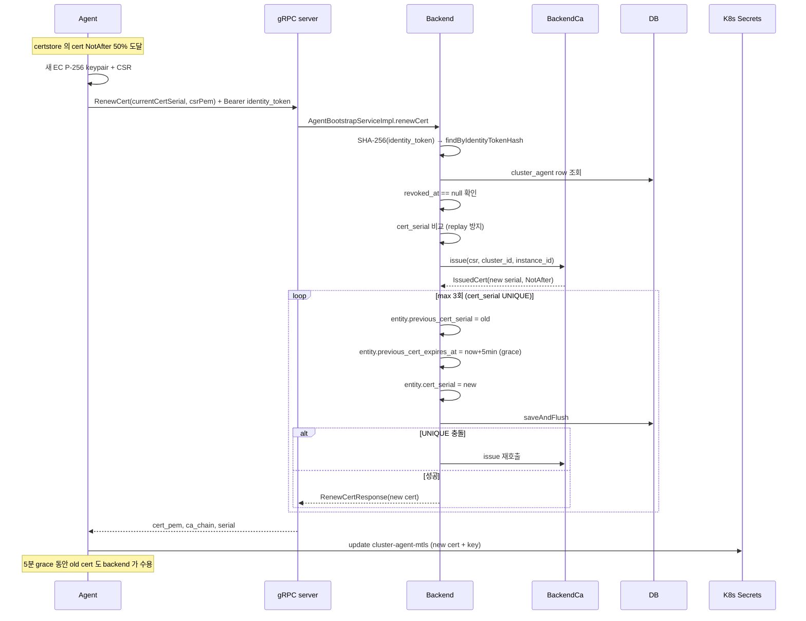
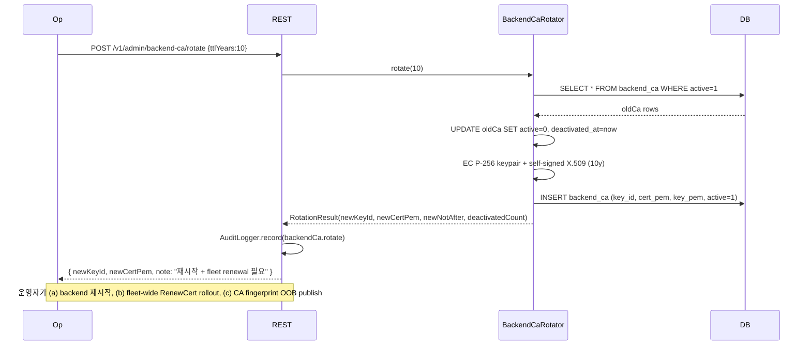
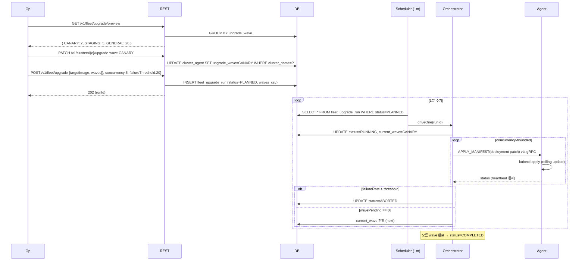

# Feature Flows

주요 기능별 end-to-end flow 입니다. file:line 인용 + DB/K8s 자원 + 실패 모드를 포함합니다. 동반 문서로는
[overview.md](./overview.md), [api-inventory.md](./api-inventory.md) 가 있습니다.

## 0. 공통 토큰 / 자격증명 종류

| 토큰 / 자격 | 발급 주체 | 저장 | TTL | 용도 |
|---|---|---|---|---|
| `registration_token` (JWT) | backend (`JwtRegistrationTokenService`) | helm `aipaas-agent-bootstrap` Secret | 10분 (jti 1회) | agent 의 첫 `Register` RPC |
| `agent_identity_token` (opaque 32B hex) | backend (`AgentBootstrapServiceImpl`) | agent `cluster-agent-identity` Secret + backend DB hash | 60일 (rotation) | runtime stream 인증 |
| Backend CA cert + key | backend (`JpaBackendCa` / `BackendCaRotator`) | `backend_ca` table | 10년 default (rotate) | agent client cert sign |
| Agent client cert | backend (`BackendCa.issue`) | agent `cluster-agent-mtls` Secret + backend DB serial | 24h (renew 50%) | mTLS dial / authn |
| Agent JWT signing key | backend (`JpaSigningKeyResolver`) | `agent_signing_key` table | 영구 (rotation 가능) | `registration_token` HMAC |

## 1. Cluster registration (Helm bootstrap)

가장 일반적인 등록 경로입니다. 운영자가 target cluster 에 helm 으로 agent 를 설치합니다.

### 1.1 Sequence



### 1.2 코드 진입점

| 단계 | File:line |
|---|---|
| `POST /v1/clusters` | `domain/cluster/web/ClusterController.java` |
| `ClusterServiceImpl.createCluster` | `domain/cluster/internal/ClusterServiceImpl.java:166` |
| `POST /v1/clusters/{id}/agent-registration` | `domain/agent/web/AgentRegistrationController.java` |
| `AgentBootstrapServiceImpl.issueRegistrationToken` | `domain/agent/bootstrap/AgentBootstrapServiceImpl.java:56` |
| gRPC `Register` 핸들러 | `libs/cluster-agent-spring-boot-starter/.../AgentBootstrapEndpoint.java` |
| `AgentBootstrapServiceImpl.register` | `domain/agent/bootstrap/AgentBootstrapServiceImpl.java:73` |
| `BackendCa.issue` (default) | `domain/agent/auth/DefaultBackendCa.java:148+` |
| `BackendCa.issue` (jpa) | `domain/agent/auth/JpaBackendCa.java:165+` |
| `issueCertWithCollisionRetry` (UNIQUE safety net) | `domain/agent/bootstrap/AgentBootstrapServiceImpl.java:300+` |

### 1.3 DB 변경

- `cluster` — INSERT (status=AGENT_PENDING → ACTIVE 한 transaction).
- `cluster_agent` — INSERT (cert_serial UNIQUE, identity_token_hash, expires_at=now+60d).
- `bootstrap_jti` — INSERT (jti = JWT JTI, dedup).

### 1.4 K8s 자원

- `aipaas-agent-bootstrap` Secret — Helm 이 미리 주입 (registration_token).
- `cluster-agent-identity` Secret — agent 가 생성 (token).
- `cluster-agent-mtls` Secret — agent 가 생성 (cert.pem, key.pem, ca.crt, serial, not_after).

### 1.5 실패 모드

| Symptom | Root cause | 조치 |
|---|---|---|
| `PERMISSION_DENIED: jwt expired` | bootstrap token 10분 초과 | 새 registration_token 재발급. **identity Secret 가 없는 cold start 만 발생** — 영구화 후엔 회피. |
| `PERMISSION_DENIED: jti already used` | 동일 token 으로 두 번째 Register | 새 token 재발급. |
| `NOT_FOUND: cluster vanished` | JWT 발급 후 cluster 삭제 | cluster 재생성 후 token 재발급. |
| `IllegalArgumentException: Invalid CSR` | agent CSR 손상 | agent 재시작 (CSR 재생성). |
| `IllegalStateException: cert_serial collision unresolved` | cert_serial UNIQUE 3회 재시도 모두 실패 | 백엔드 SecureRandom 상태 점검. DB 의 stale row 확인. |

## 2. Cluster import (kubeconfig 직접 등록)

agent 미설치 cluster 를 외부 kubeconfig 만으로 등록합니다.

```
POST /v1/clusters
  body: { clusterName, apiServerUrl, serverCA, clientCA, clientKey }

  ClusterServiceImpl.createCluster
    ├ validateBase64Pem (PEM 형식 검증, fail-fast)
    ├ apiServerUrl + serverCA 모두 존재?
    │   ├─ yes → status=UNKNOWN, async 버전 fetch (AgentBootstrapKubeClient)
    │   └─ no  → status=AGENT_PENDING (agent 가 등록되면 backfill)
    └ DB INSERT cluster
        ├ DataIntegrityViolation → 409 DUPLICATE
        └ OK → 201 Created
```

**실패 모드:**
- 중복 이름 → 409 DUPLICATE 입니다.
- base64/PEM 손상 → 400 INVALID_INPUT_VALUE 입니다.
- API server unreachable → status=UNKNOWN 으로 남습니다. retry/refresh op 를 호출합니다.

## 3. Cert renewal (mTLS lifecycle)

cluster-agent 가 cert TTL 50% 도달 시 자동으로 갱신합니다.

### 3.1 Sequence



### 3.2 코드 진입점

| 단계 | File:line |
|---|---|
| `RenewCert` 핸들러 | `libs/cluster-agent-spring-boot-starter/.../AgentBootstrapEndpoint.java` |
| `AgentBootstrapServiceImpl.renewCert` | `apps/anycloud/.../AgentBootstrapServiceImpl.java:170+` |
| `issueCertWithCollisionRetry` | 같은 파일 line 300+ |
| Grace sweeper | `ClusterAgentRepository.clearExpiredPreviousCerts` |
| Agent renewal 트리거 | `apps/agent/internal/core/cert_renewal.go` |

### 3.3 실패 모드

| Symptom | Root cause |
|---|---|
| `PERMISSION_DENIED: identity_token not found` | rotation 직후 stale token 사용 |
| `PERMISSION_DENIED: agent revoked at <ts>` | 운영자가 cert revoke |
| `PERMISSION_DENIED: cert_serial mismatch` | replay 시도 또는 stolen cert |
| `PERMISSION_DENIED: invalid CSR` | agent CSR 파손 |
| `IllegalStateException: cert_serial collision` | 3회 재시도 후 UNIQUE 충돌 (사실상 불가) |

## 4. Identity token rotation

24h 주기 또는 만료 5일 전 자동으로 rotation 합니다.

```
Agent (timer)
  identitystore.Token().ExpiresAt − now < 5d
    Agent → RotateIdentityToken(currentTokenHash) + Bearer current_token
    Backend.AgentBootstrapServiceImpl.rotateIdentityToken (line 273)
      ├ findByIdentityTokenHash → row
      ├ revoked_at == null & not expired 확인
      ├ generateOpaqueToken (32B hex)
      ├ SHA-256 hash
      ├ entity.identity_token_hash = newHash
      ├ entity.expires_at = now + ttlDays
      ├ entity.revoked_at = null (prior revoke 해제)
      └ save()
    Response: { newToken, expiresAt }
  Agent.identitystore.Save(newToken)
```

**실패 모드:**
- `current identity_token not found` → token 재발급이 불가합니다 (revocation 되었거나 db row 삭제됨). 새 registration 이 필요합니다.
- `agent revoked at <ts>` → 운영자 결정에 따릅니다. unrevoke 가 필요합니다.
- `identity_token already expired` → grace 가 없습니다. 새 registration_token + Register RPC 를 재진행합니다.

## 5. Cluster delete cascade

```
DELETE /v1/clusters/{name}
  ClusterController → ClusterServiceImpl.deleteCluster (line 404)
    ├ getClusterEntity(name)  ← lenient fallback
    ├ assertImportedCluster(c)  ← PULUMI 거부
    ├ clusterAgentRepository.deleteByClusterName(c.id)  ← cascade
    │     로그: "Cluster {} delete cascaded {} agent row(s)"
    ├ clusterRepository.delete(c)
    └ bootstrapKubeClient.invalidate(c.id)  ← fabric8 cache 무효화
  Return 200
```

**Note:** target cluster 의 K8s Secret 들은 그대로 남습니다 (`helm.sh/resource-policy=keep`).
운영자가 [`cluster-agent-secret-cleanup.md`](../runbooks/cluster-agent-secret-cleanup.md) 절차로 정리합니다.

**실패 모드:**
- `ClusterNotFoundException` → 이미 삭제되었습니다.
- `CustomException: VM 기반 클러스터` → `/system/vm/clusters` API 사용을 안내합니다.
- 동시 delete 경쟁 → DB-level row-lock 으로 idempotent 합니다 (한 쪽만 영향을 받습니다).

## 6. CA rotation (admin)



**전제:**
- `anycloud.mtls.ca.persistence=jpa` 가 활성이어야 합니다 (default mode 는 startup random 입니다).
- 운영자가 endpoint 호출 후 추가 작업을 수행합니다 (이 endpoint 자체는 DB 변경만 수행합니다).

**실패 모드:**
- `ttlYears` 범위 외 → 400 BadRequest 입니다.
- BouncyCastle 실패 → IllegalStateException 입니다 (RNG / JCE 점검 필요).

## 7. Cert revocation (admin)

```
POST /v1/admin/clusters/{name}/cert/revoke
  body: { certSerialHex?, reason? }

  AdminAgentCertController.revoke
    ├ certSerialHex 있음?
    │   ├─ yes → AgentCertRevocationService.revokeByCertSerial(clusterName, hex, reason)
    │   │       └ UPDATE cluster_agent SET revoked_at=now, last_error=reason
    │   │         WHERE cluster_name=? AND cert_serial=?
    │   └─ no  → revokeCluster(clusterName, reason)
    │           └ UPDATE cluster_agent SET revoked_at=now, last_error=reason
    │             WHERE cluster_name=? AND revoked_at IS NULL
    ├ sessionRegistry.evictByCluster(clusterName, reason)  ← forced disconnect
    │   └ 모든 active stream onError(PERMISSION_DENIED) + unregister
    └ AuditLogger.record(agentCert.revoke)
```

⚠️ tech-debt: cert-serial 단위 revoke 도 cluster 전체 stream 을 끊습니다 — 단일 instance scoped eviction 이 필요합니다.

**복구:** `POST /v1/admin/clusters/{name}/cert/unrevoke` — `revoked_at=null, status=REGISTERED` 입니다.

## 8. Fleet upgrade (admin)

waved-based rolling upgrade 입니다.

### 8.1 Wave 모델

```
upgrade_wave enum: CANARY → STAGING → GENERAL → PAUSED
```

같은 cluster 의 모든 agent row 는 동일한 wave 를 가집니다 (replica 간 동기). PATCH wave 시 일괄 update 됩니다.

### 8.2 Sequence



### 8.3 코드 진입점

| 단계 | File:line |
|---|---|
| Preview / submit | `domain/agent/web/FleetUpgradeController.java` |
| Orchestrator drive | `domain/agent/upgrade/FleetUpgradeOrchestratorImpl.java:149-283 (driveOne)` |
| 단일 cluster trigger | 같은 파일 `triggerUpgrade()` |

⚠️ tech-debt: `driveOne` 는 135 LOC / cyclomatic ~14 / 테스트 0 입니다.

### 8.4 실패 모드

| Symptom | Root cause |
|---|---|
| `409 Conflict: already in progress` | 동일 cluster 에 진행 중인 run |
| wave 무한 PAUSED | failureThreshold 초과 — 운영자 manual abort 필요 |
| agent 응답 없음 | heartbeat timeout → cluster_agent.status=FAILED |
| 부분 성공 | abort 가 새 cluster 만 차단. 진행 중인 K8s rolling update 는 그대로 진행 |

## 9. Agent policy 관리

ConfigMap-driven 이며, backend 는 read-only 관찰자 + PUT/PATCH 로 수정합니다.

```
GET /v1/admin/agent/policy/preview?cluster={c}
  AgentPolicySnapshot 가져옴 (allowedNamespaces, allowedCommands, allowedCharts)
  validation warnings 첨부 (e.g., "*" wildcard 보안 경고)

GET /v1/admin/agent/policy/audit
  parallel for cluster in fleet:
    snapshot 가져옴 (timeout 보호)
  종합 보고

PUT /v1/admin/clusters/{c}/agent-policy
  body: { allowedNamespaces, allowedCommands, allowedCharts } (모두 required)
  ConfigMap 전체 replace

PATCH (legacy)
  null = keep — backwards compat
PATCH (RFC 7396)
  null = clear, omit = keep
```

backend 가 target cluster 의 ConfigMap (`aipaas-agent-allowlist`) 을 fabric8 client 로 직접 수정합니다.
agent 의 `config.Loader` 가 ConfigMap watch 로 감지 후 in-memory 정책에 반영합니다.

⚠️ tech-debt: `AdminAgentPolicyController` 는 771 LOC 이며 — fleet audit 의 parallel collector 가 controller 에 위치합니다. service 추출을 권고합니다.

## 10. Audit logging 흐름

```
서비스 (Service / Controller)
  AuditLogger.record(AuditEntry.builder()...)
    → DbAuditLogger (active impl)
        → audit_log row INSERT
```

`audit_log` 테이블은 다음 컬럼을 가집니다.
- `id`, `timestamp`, `actor` (gateway header 추출), `action`, `resource_type`, `resource_id`,
  `status_code`, `request_summary`, `created_at`.

조회는 `GET /v1/audit-logs?action=...&resourceType=...` 입니다.

⚠️ tech-debt: audit 호출이 controller 마다 boilerplate 입니다. AOP / annotation 으로 service 레벨에 옮기는 것을 권고합니다.

## 11. VM cluster provisioning (Pulumi, 별도 경로)

가장 복잡한 flow 이지만 mTLS / agent 와는 독립입니다.

```
POST /v1/clusters {provisioningType=PULUMI, providerConfig, ...}
  ClusterServiceImpl 가 VmClusterService 로 위임
  → RabbitMQ workflow.queue 로 메시지
  → VmClusterWorkflowConsumer
      → PulumiOrchestrator
          → external 'pulumi up' (process exec)
              → infra/pulumi/main.go 가 CSP provisioning
  → operation row 상태 갱신
  → 완료 후 helm install cluster-agent (위 §1 flow 와 합류)
```

상세는 별도 문서를 참고합니다 (`docs/architecture/vm-provisioning.md` — TBD).

## 12. SSE event streaming (operation events)

```
GET /v1/operations/{id}/events
  OperationEventsController
    → SseEmitter 등록 (per request)
    → AsyncBus (Spring ApplicationEvent) subscribe
    → operation 상태 변경 시 ApplicationEventPublisher.publishEvent(OpEvent)
    → 모든 emitter 에게 push
  client 가 EventSource 로 수신 → JSON parse
```

heartbeat 30s 로 connection alive 를 확인합니다. cancellation 은 client disconnect 시 emitter 를 remove 합니다.

## 13. 관련 자료

- 코드: `apps/anycloud/src/main/java/com/aipaas/anycloud/domain/agent/`
- 코드: `apps/agent/internal/core/`
- 코드: `libs/cluster-agent-spring-boot-starter/src/main/java/io/aipaas/cluster/agent/runtime/`
- 정리 절차: [`../runbooks/cluster-agent-secret-cleanup.md`](../runbooks/cluster-agent-secret-cleanup.md)
- Impersonation 인증: [`k8s-impersonation-auth.md`](./identity/k8s-impersonation-auth.md)
