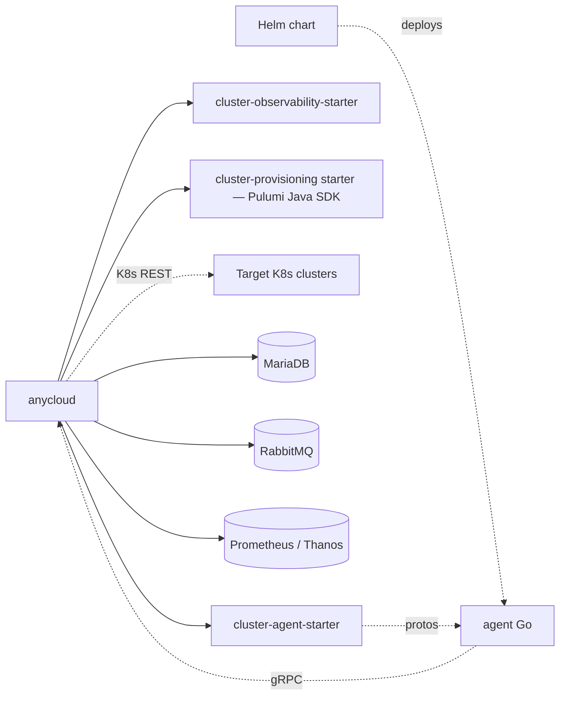

# Architecture Overview

anycloud monorepo 의 component / package / 의존 관계를 정리했습니다. 자세한 API 목록은
[`api-inventory.md`](./api-inventory.md), 주요 flow 는 [`feature-flows.md`](./feature-flows.md) 를
참고합니다.

## 1. 전체 구성

```
┌────────────────────────────────────────────────────────────────┐
│                     User / Operator                            │
│            (web UI, kubectl, curl, helm, postman)              │
└─────────────────────┬──────────────────────────────────────────┘
                      │ REST / SSE
┌─────────────────────▼──────────────────────────────────────────┐
│            anycloud Spring Boot Backend (Java 21)              │
│  ┌────────────────────────────────────────────────────────┐    │
│  │  REST Controllers  (≈ 120 endpoints, 25 domains)       │    │
│  └───────────────────┬────────────────────────────────────┘    │
│                      │                                         │
│  ┌───────────────────▼────────────────────────────────────┐    │
│  │  Service Layer (cluster / agent / upgrade / audit /    │    │
│  │  vmoptions / credential / chart / observability ...)   │    │
│  └─────┬─────────────┬──────────────────┬──────────────────┘    │
│        │             │                  │                       │
│  ┌─────▼────┐   ┌────▼─────┐   ┌────────▼──────────┐            │
│  │  JPA     │   │ gRPC     │   │ K8s client       │            │
│  │  (Maria) │   │  Server  │   │ (fabric8 +       │            │
│  │  Flyway  │   │  9090    │   │  starter SPI)    │            │
│  └──────────┘   └─────┬────┘   └─────────┬─────────┘            │
└───────────────────────│──────────────────│──────────────────────┘
                        │ gRPC (mTLS opt.) │ K8s REST (kubeconfig)
                        │                  │
                 ┌──────▼──────┐   ┌───────▼────────┐
                 │ cluster-    │   │  Target        │
                 │ agent (Go)  │◄──┤  Kubernetes    │
                 │ in target   │   │  cluster(s)    │
                 │ K8s cluster │   │                │
                 └─────────────┘   └────────────────┘
```

3-tier 구조 — **REST/UI (control plane)** → **Backend (Java)** → **agent (Go, in target cluster)**
가 핵심 축이며, **Pulumi provisioner** 와 **RabbitMQ workflow** 는 VM 기반 cluster 생성 시의 별도 경로입니다.

| Component | 위치 | 책임 |
|---|---|---|
| `apps/anycloud` | Spring Boot 3.5.16 / Java 21 | REST + gRPC server. JPA / Flyway. 핵심 control plane. |
| `apps/agent` | Go 1.26+ | target K8s cluster 내 sidecar/controller. bearer-over-TLS bidi stream 으로 backend 와 통신. |
| `libs/cluster-agent-spring-boot-starter` | Java starter (**Layer 1**) | gRPC schema (proto), starter SPI (runtime/identity/exec/logstream) — anycloud 와 모든 Layer 2/3 starter 가 의존. → [Extension guide](./starters/starter-extension-guide.md) |
| `libs/cluster-agent-features-spring-boot-starter` | Java starter (**Layer 2**) | RBAC, Backup, Observability 통합. v0.3.0 에서 observability / backup starter 를 흡수했다. |
| `libs/cluster-provisioning-spring-boot-starter` | Java starter | VM cluster provisioning. Pulumi **Java SDK** 기반이며 provider 별 `*Provisioner` 로 구현. v0.3.0 에서 Go 구현(`infra/pulumi`)을 대체했다. |
| `apps/agent/deploy/helm/cluster-agent` | Helm chart | target cluster 에 agent 배포 패키지. |

## 2. anycloud Backend (Java) — package 지도

`apps/anycloud/src/main/java/com/aipaas/anycloud/` 기준입니다.

| Package | 책임 | 핵심 클래스 |
|---|---|---|
| `controller` | REST endpoint. ~25 controllers | `ClusterController`, `AdminAgentCertController`, `AgentBootstrapPublicController`, `FleetUpgradeController`, `ObservabilityController` |
| `service.cluster` | unified cluster 관리, provider-agnostic | `ClusterServiceImpl`, `UnifiedClusterServiceImpl`, `AgentBootstrapKubeClient` |
| `service.vmcluster` | VM cluster state machine + workflow | `VmClusterWorkflowQueueServiceImpl`, `VmClusterStateMachine` |
| `service.credential` | CSP credential 암호화 vault | `CspCredentialServiceImpl`, `CspCredentialCryptoServiceImpl` |
| `service.operation` | long-running op tracking + sweeper | `OperationServiceImpl` |
| `service.vmoptions` | VM 스펙 카탈로그 (provider/region/spec/image) | `AbstractVmOptionsProvider` + CSP-specific impl |
| `service.agent` | agent 라이프사이클 / mTLS / cert | `AgentBootstrapServiceImpl`, `AgentCertRevocationService`, `BackendCa`, `BackendCaRotator` |
| `service.agent.upgrade` | fleet-wide agent rollout | `FleetUpgradeOrchestratorImpl` |
| `service.webhook` | 외부 portal 로의 push 이벤트 | `WebhookPublisher` |
| `service.audit` | 감사 로그 SPI | `AuditLogger`, `DbAuditLogger` |
| `service.monitoring` | Prometheus / cert expiry | `CertExpiryScheduler`, `ObservabilityServiceImpl` |
| `service.kube` / `service.helmrepo` | K8s client + Helm repo | `KubeServiceImpl`, `HelmRepoServiceImpl` |
| `service.provisioning` | Pulumi 오케스트레이션 | `PulumiOrchestrator` |
| `model.entity` | JPA `@Entity` 15+ classes | (3절 참고) |
| `model.dto` | request / response DTO | versioned `request/`, `response/` 분리 |
| `model.enums` | 상태 / 종류 enums | `ClusterStatus`, `ClusterAgentStatus`, `ClusterAgentUpgradeWave` |
| `common.error` | 예외 + 글로벌 핸들러 | `GlobalExceptionHandler`, `CustomException`, `ErrorCode` |
| `common.security` | bearer / OAuth filter (toggle) | `StaticTokenAuthFilter` |
| `common.validation` | 입력 검증 상수 + custom validator | `ApiValidationConstants` |
| `common.web` | HTTP 인터셉터 / idempotency | `IdempotencyFilter`, `ResponseEnvelopeAdvice` |
| `common.util` | 공통 helper | `Common`, `HexUtil` (소수) |
| `configuration.*` | Spring `@Configuration` | (4절 참고) |
| `grpc` | starter 가 노출한 gRPC bean 진입 | starter wiring |

### 2.1 Layering 준수도

| Controller | 호출 패턴 | 평가 |
|---|---|---|
| `ClusterController` | Service-only | OK |
| `VmOptionsController` | Service-only | OK |
| `AdminAgentCertController` | Service + Repository (직접) | ⚠️ cert 관리 endpoint 추가 시 repository 직접 inject — service 추출 필요 |
| `ClusterController` (일부) | Repository 직접 (`stateHistoryRepository`) | ⚠️ Layering 위반 |
| `FleetUpgradeController` | Repository 직접 (`runRepository.findTop20...`) | ⚠️ Layering 위반 |

→ 대부분 controller→service→repository 구조가 깨끗하지만, 4개 controller 가 repository 를 직접 inject 하고 있습니다.

## 3. JPA Entity 인벤토리

| Entity | 테이블 | 책임 | 주요 관계 |
|---|---|---|---|
| `ClusterEntity` | `cluster` | 등록/생성된 K8s cluster 메타 | ← `ClusterAgentEntity` (1:N) |
| `VmClusterEntity` | `vm_cluster` | Pulumi provisioned VM cluster 이력 | ← `VmClusterStateHistoryEntity` |
| `ClusterAgentEntity` | `cluster_agent` | agent instance 별 메타 + cert + identity hash | ← `ClusterEntity` |
| `OperationEntity` | `operation` | long-running op (provision / scale / upgrade) | ← `ClusterEntity`, `VmClusterEntity` |
| `AuditLogEntity` | `audit_log` | 감사 추적 (admin action / state change) | (free) |
| `BackendCaEntity` | `backend_ca` | mTLS root CA (active row + history) | (root) |
| `AgentSigningKeyEntity` | `agent_signing_key` | JWT registration_token signing key | (root) |
| `CspCredentialEntity` | `csp_credential` | 암호화된 CSP secret vault | (free) |
| `HelmRepoEntity` | `helm_repo` | Helm chart repository 메타 | ← chart cache (transient) |
| `WorkflowMessageLogEntity` | `workflow_message_log` | RabbitMQ workflow 이벤트 | ← `VmClusterEntity` |
| `VmClusterStateHistoryEntity` | `vm_cluster_state_history` | VM cluster state machine 이력 | ← `VmClusterEntity` |
| `FleetUpgradeRunEntity` | `fleet_upgrade_run` | 다중 cluster upgrade batch | (root) |
| `BootstrapJtiEntity` | `bootstrap_jti` | JWT JTI 재사용 방지 | (root) |
| `IdempotencyRecordEntity` | `idempotency_record` | Idempotency-Key 응답 캐시 | (root, TTL 24h) |
| `MonitEntity` | `monit` | monitoring/observability 이벤트 로그 | (root) |

**Note:** 명시적 FK 가 거의 없습니다 (application-level cascade). 의도는 cluster 삭제 시
`cluster_agent` 만 cascade 하고, 다른 테이블은 TTL sweeper 가 정리하는 것입니다.

## 4. Spring `@Configuration` 클래스

| Class | 위치 | 책임 | 노출 Bean |
|---|---|---|---|
| `WebSecurityConfig` | `configuration.security` | Static bearer token auth (toggle) | `SecurityFilterChain` |
| `WebSecurityDisabledConfig` | `configuration.security` | gateway-managed auth (permitAll) | `SecurityFilterChain` |
| `WebConfig` | `configuration.web` | CORS, header reg | — |
| `WebMvcInterceptorConfig` | `configuration.web` | 로깅 / req-resp wrap | `HandlerInterceptor` |
| `CacheConfig` | `configuration.persistence` | Spring Cache L2 | `CacheManager` |
| `ShedLockConfig` | `configuration.persistence` | 분산 잡 락 (sweeper / cert expiry) | `LockProvider` |
| `DevFlywayMigrationStrategy` | `configuration.persistence` | dev 모드 baseline skip | — |
| `BeanConfig` | `configuration.infrastructure` | RestTemplate / WebClient / YAML / ObjectMapper | (위 4개) |
| `OpenApiConfig` | `configuration.infrastructure` | springdoc swagger UI | docs groups |
| `BouncyCastleConfig` | `configuration.infrastructure` | JCE provider 등록 | — |
| `AsyncConfig` | `configuration.domain` | `@Async` thread pool | `Executor` |
| `AgentConfiguration` | `configuration.domain` | cluster-agent starter wiring | gRPC server beans |
| `RabbitMqVmClusterWorkflowConfiguration` | `configuration.domain` | RabbitMQ listener (있을 때만) | `SimpleMessageListenerContainer` |

## 5. SPI 경계 (interface + 다중 impl)

| Interface | impl | 활성화 조건 |
|---|---|---|
| `BackendCa` | `JpaBackendCa` (**default**), `DefaultBackendCa` | `anycloud.mtls.ca.persistence` 미지정 → JPA. 명시적 `default` 시 inline-pem mode. |
| `AuditLogger` | `InMemoryAuditLogger`, `DbAuditLogger` | `@ConditionalOnProperty` |
| `ClusterProvider` | `VmClusterProviderImpl`, `RegisteredClusterProviderImpl` | source type 기반 — registry pattern |
| `VmOptionsProvider` | AWS/Azure/GCP/Proxmox/Ncloud impl | provider name 기반 — registry |
| `SigningKeyResolver` (starter) | `JpaSigningKeyResolver` (anycloud override) | `@ConditionalOnMissingBean` |
| `BootstrapKubeClient` (starter) | `AgentBootstrapKubeClient` (anycloud) | `@ConditionalOnMissingBean` |

### 5.1 Service / Impl 분리 (`XxxService` interface + `impl/XxxServiceImpl`)

| Domain | Interface | Impl |
|---|---|---|
| Cluster CRUD | `ClusterService` | `impl.ClusterServiceImpl` |
| Cluster connectivity / status sync | `ClusterConnectivityService` | `impl.ClusterConnectivityServiceImpl` |
| Cluster fleet health 집계 | `ClusterFleetHealthService` | `impl.ClusterFleetHealthServiceImpl` |
| Operation tracking | `OperationService` | `impl.OperationServiceImpl` |
| Unified cluster facade | `UnifiedClusterService` | `impl.UnifiedClusterServiceImpl` |
| Agent bootstrap | `AgentBootstrapService` | `bootstrap.AgentBootstrapServiceImpl` |
| Agent cert revocation | `AgentCertRevocationService` | `auth.impl.AgentCertRevocationServiceImpl` |
| Agent cert metadata 조회 | `AgentCertQueryService` | `auth.impl.AgentCertQueryServiceImpl` |
| Backend CA rotation | `BackendCaRotator` | `auth.impl.BackendCaRotatorImpl` |
| Fleet upgrade runs 조회 | `FleetUpgradeRunQueryService` | `upgrade.impl.FleetUpgradeRunQueryServiceImpl` |
| Agent policy audit | `AgentPolicyAuditService` | `policy.impl.AgentPolicyAuditServiceImpl` |
| VM cluster state history 조회 | `VmClusterStateHistoryQueryService` | `vmcluster.impl.VmClusterStateHistoryQueryServiceImpl` |
| Audit logging | `AuditLogger` (SPI) | `DbAuditLogger`, `InMemoryAuditLogger` |
| Audit logs 조회 | `AuditLogService` | `audit.impl.AuditLogServiceImpl` |
| Kubeconfig YAML 생성 | `KubeconfigBuilder` | `cluster.kubeconfig.impl.KubeconfigBuilderImpl` |

### 5.2 Cross-cutting components

| Component | 위치 | 책임 |
|---|---|---|
| `BackendCaCryptoUtil` | `service.agent.auth` | X.509 / PEM / keypair 공통 crypto |
| `BackendCaHealthIndicator` | `service.agent.auth` | `/actuator/health/backendCa` — mode + notAfter + sha256 |
| `@Audited` + `AuditAspect` | `service.audit` | service-method 자동 audit (SpEL based) |
| `BootstrapRateLimitFilter` | `common.web` | `/v1/agent-bootstrap/**` per-IP 60 req/min |
| `IdempotencyFilter` | `common.web` | Spring `ContentCachingResponseWrapper` 기반 |
| `AgentProperties` | `configuration.domain` | `@ConfigurationProperties("agent")` — 5 nested records |

## 6. Configuration namespace

`apps/anycloud/src/main/resources/application.yaml` (+ profile / config 분할 5개 파일) 은 다음과 같습니다.

| Namespace | 용도 | Profile-specific |
|---|---|---|
| `spring.*` | Spring Boot core (datasource, JPA, Flyway, RabbitMQ) | yes |
| `springdoc.*` | OpenAPI / Swagger UI | no |
| `security.auth.*` | static token auth toggle | yes |
| `resilience4j.*` | circuit breaker / retry | yes |
| `vm-options.*` | pagination 설정 | no |
| `csp-credential.*` | encryption key | yes |
| `cluster.cert.*` | cert expiry sweeper cron | yes |
| `anycloud.*` | idempotency / helm timeout / webhook / mTLS | yes |
| `webhook.*` | 외부 portal push | yes |
| `management.*` | Actuator / Prometheus | yes |
| `agent.*` | helm repo / chart / namespace (registration 가이드용) | yes |

Profile 변형은 다음과 같습니다.
- `application.yaml` — 공통입니다 (import config/*.yaml).
- `application-dev.yaml` — 로컬용입니다 (`ddl-auto=update`).
- `application-docker.yaml` — 컨테이너용입니다 (env-driven, `ddl-auto=validate`).
- `application-test.yaml` — 통합 테스트용

→ tech-debt: cross-file `@Value` 주입이 silent 합니다 — `cluster-agent.jwt.secret` 은 `agent.yaml`, `cluster.cert.*` 는 `runtime.yaml` 에 있습니다. validation 이 부재합니다. `agent.*` 는 단일 `AgentProperties` record 로 type-safe binding 됩니다.

## 7. cluster-agent (Go) — package 지도

`apps/agent/internal/` 의 패키지는 다음과 같습니다.

| Package | 책임 |
|---|---|
| `bootstrap` | 첫 register RPC (JWT 검증 → identity token + cert 발급) |
| `certstore` | K8s Secret `cluster-agent-mtls` 영구화 |
| `identitystore` | K8s Secret `cluster-agent-identity` 영구화 |
| `cert_renewal` | TTL 50% 도달 시 자동 RenewCert |
| `rotation` | identity token 자동 rotation |
| `runtime` | bidi gRPC stream (heartbeat 30s + control msg dispatch) |
| `config` | allowlist ConfigMap watch |
| `allowlist` | namespace / command / helm chart 정책 enforcement |
| `controller` | command dispatcher (exec / logs / k8s ops) |
| `k8s` | discovery / dynamic / restmapper |
| `exec` | pod exec (stdin/stdout/stderr) |
| `helm` | release enumeration |
| `logstream` | gRPC pod log streaming |
| `tlsconfig` | env → TLS config |
| `leader` | leader lease (HA replicas 시) |
| `cleanup` | debug pod TTL sweeper |

### 7.1 Entry point + lifecycle

| Phase | 코드 | 행위 |
|---|---|---|
| Bootstrap (1회) | `cmd/cluster-agent/main.go` → `core.Bootstrap` | Register RPC, K8s 자동 발견 (UID/version), Secret 에 token+cert 영구화 |
| Cert renewal | `core.CertRenewal` (timer) | NotAfter 50% 도달 시 CSR + RenewCert RPC |
| Token rotation | `core.Rotation` (timer) | identity token 만료 5일 전 RotateIdentityToken RPC |
| Heartbeat | `core.RuntimeStream` | 30s 주기 AgentMessage / ControlMessage. exp backoff 재연결 |
| Shutdown | SIGTERM handler | context cancel + leader lease 반납 + debug pod cleanup |

### 7.2 Helm chart 구성

`apps/agent/deploy/helm/cluster-agent/templates/` 의 구성은 다음과 같습니다.

| Template | 책임 |
|---|---|
| `deployment.yaml` | core/installer Deployment, env, volume mounts, RBAC SA |
| `rbac.yaml` | ClusterRoles + RoleBindings (core: read-only, installer: mutating) |
| `secret.yaml` | `aipaas-agent-bootstrap` Secret (registration_token) |
| `configmap.yaml` | `aipaas-agent-allowlist` ConfigMap |
| `namespace.yaml` | `aipaas-system` |
| `_helpers.tpl` | 공통 label / selector |
| `NOTES.txt` | post-install 안내 |

**`helm.sh/resource-policy: keep`** annotation 이 Secret 들에 적용됩니다 — `helm uninstall` 시 cert/identity 를
보존합니다 (의도된 design 이며, 재기동 시 stale state 를 회피합니다). cluster 폐기 후에는 manual cleanup 이 필요합니다
([cluster-agent-secret-cleanup.md](../runbooks/cluster-agent-secret-cleanup.md)).

### 7.3 환경변수 (주요)

| Env | 기본 | 용도 |
|---|---|---|
| `BACKEND_GRPC_ADDR` | `localhost:9090` | backend endpoint |
| `REGISTRATION_TOKEN` | (Secret) | bootstrap JWT |
| `AGENT_INSTANCE_ID` | auto | HA replica 구분 |
| `AGENT_MODE` | `core` | `core` / `installer` |
| `AGENT_NAMESPACE` | `aipaas-system` | Secret/CM 위치 |
| `K8S_CLUSTER_UID` | auto | kube-system UID |
| `BACKEND_TLS_ENABLED` | `false` | TLS 활성 |
| `BACKEND_CA_CERT_PEM` | — | inline CA (혹은 `_PATH`) |
| `MTLS_DIAL_ENABLED` | `false` | client cert dial (Phase 5+) |
| `AGENT_LEADER_ELECTION` | `false` | multi-replica 리더 |

## 8. cluster-agent-spring-boot-starter — 노출 SPI

| Package | anycloud 가 사용 |
|---|---|
| `core` | `ClusterAgentRegistry` (registry) |
| `identity` | `SigningKeyResolver` (anycloud override) |
| `grpc` | gRPC server + bidi handler |
| `runtime` | `AgentSessionRegistry`, `AgentHealthService` |
| `logstream` | pod log streaming RPC |
| `terminal` | pod exec RPC |
| `autoconfigure` | `ClusterAgentAutoConfiguration` |

## 9. 의존성 다이어그램



- **anycloud 가 starter 에 의존합니다** — starter 의 `AgentRuntimeEndpoint` 가 backend 의 gRPC 서버입니다.
- **agent 는 starter 의 proto 만 의존합니다** — starter 의 Java 코드는 사용하지 않습니다.
- **Pulumi 호출은 외부 프로세스 exec 입니다** — Java↔Pulumi 직접 의존이 없습니다.
- **K8s 통신은 두 경로입니다** — (a) backend 가 직접 fabric8 으로 target cluster API 호출 (bootstrap / kubeconfig
  발급), (b) agent 가 in-cluster K8s API 호출 (대부분의 read/write).

## 10. 테스트 커버리지

총 **689 tests PASS** 입니다 (anycloud + starter).

| 영역 | 테스트 | 평가 |
|---|---|---|
| anycloud controller | ~20 files | 신규 admin endpoint 모두 cover |
| anycloud service.cluster | 5+ files | cascade test 포함, ClusterServiceImpl 488 LOC |
| anycloud service.agent.auth | 3 신규 (revocation 11 / rotator 9 / crypto util 11) | **모두 cover** |
| anycloud service.agent.upgrade | 1 (read service) | orchestrator 일부 cover (driveOne split 후 helper 별 분리) |
| anycloud service.audit | (mock 통한 controller test) | `@Audited` aspect 자체 test 는 후속 |
| anycloud cluster.kubeconfig | 1 신규 (KubeconfigBuilderImpl 9 cases) | cover |
| agent (Go) `core` | 6 | bootstrap / rotation cover, cert_renewal 미커버 |
| agent (Go) 외 패키지 | ~10 | `helm`, `leader`, `logstream` 없음 |
| cluster-provisioning starter | — | **거의 없음** |

→ 변경 이력은 `git log` 를 참고합니다.

## 11. 변경 빈도가 높은 hotspots

| File | 현재 LOC | 비고 |
|---|---|---|
| `ClusterServiceImpl.java` | **488** | connectivity logic 분리 적용 |
| `AdminAgentPolicyController.java` | **~630** | fleet-audit 추출 적용 |
| `AgentBootstrapServiceImpl.java` | 350+ | `@Audited` 4건 + V24 retry |
| `FleetUpgradeOrchestratorImpl.java` | 320+ | driveOne 5개 split |
| `AgentSessionRegistry.java` (starter) | 322 | Caffeine 도입 |
| `agent/internal/core/runtime.go` | — | — |

→ 책임이 너무 큰 클래스들입니다. 추가 split 을 권고합니다.

## 12. 핵심 안전장치

- **mTLS 영구화** — `JpaBackendCa` 가 default 로 활성화됩니다. backend 재시작에도 CA 가 유지됩니다.
- **CA health** — `BackendCaHealthIndicator` 가 `/actuator/health/backendCa` 에 mode + notAfter + fingerprint 를 노출합니다.
- **cert revocation** — DB `revoked_at` 마킹 → 다음 stream 시 PERMISSION_DENIED 가 반환됩니다.
- **forced disconnect** — `AgentSessionRegistry.evictByCluster` 가 active stream 을 즉시 종료합니다.
- **fingerprint banner** — startup log 에 CA SHA-256 을 출력합니다 → 운영자 OOB 검증용
- **identity token 영구화** — agent 측 `cluster-agent-identity` Secret 입니다. rollout 시 JWT expired 를 회피합니다.
- **cert UNIQUE 제약** — `cert_serial` UNIQUE + retry safety net
- **cascade cleanup** — cluster 삭제 시 `cluster_agent` 동기 정리
- **idempotency** — `Idempotency-Key` header → 24h 응답 캐시입니다. Spring `ContentCachingResponseWrapper` 기반입니다.
- **kubeconfig MITM 방어** — `serverCa` 가 있으면 `certificate-authority-data` 를 발급합니다. 없으면 WARN log + insecure fallback 입니다.
- **`@Audited` AOP** — service method 를 자동으로 audit 합니다. internal callers 도 우회할 수 없습니다.
- **bootstrap rate-limit** — Cache-Control: max-age=300 + per-IP 60 req/min 입니다.
- **pendingByRequest bounded** — Caffeine `maximumSize=10_000` + `expireAfterWrite=5m` 입니다. OOM 을 방지합니다.

## 13. 관련 문서

- [api-inventory.md](./api-inventory.md) — REST + gRPC endpoint 목록
- [feature-flows.md](./feature-flows.md) — 등록 / 갱신 / 회수 / 업그레이드 flow
- [k8s-impersonation-auth.md](./identity/k8s-impersonation-auth.md) — user RBAC pass-through 디자인입니다.
