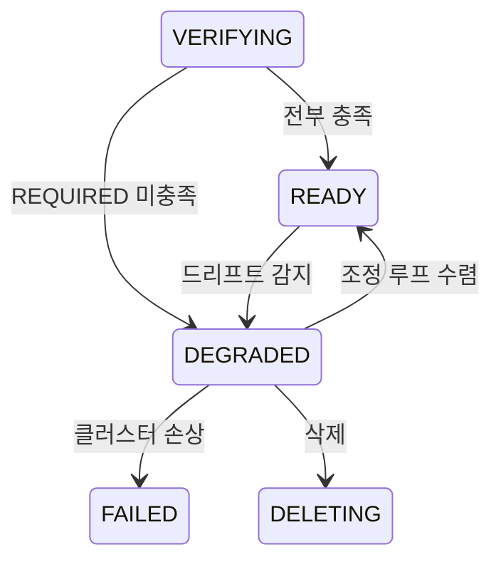

# VM 클러스터 컴포넌트 수렴

VM 생성 이후 계층(GPU 드라이버, GPU operator, ingress, cluster agent)을 요청한 사양에 맞을 때까지
재시도하고, 맞지 않는 상태를 숨기지 않고 드러내기 위한 설계입니다.

관련 문서는 [vmcluster-workflow.md](vmcluster-workflow.md),
[vmcluster-state-machine.md](vmcluster-state-machine.md),
[bootstrap-strategy-pattern.md](bootstrap-strategy-pattern.md) 입니다.

## 1. 무엇을 푸는 문제인가

현재 워크플로우는 `PROVISION → BOOTSTRAP → VERIFY → READY` 의 일회성 파이프라인입니다.
VERIFY 단계는 `kubectl get --raw=/readyz` 만 확인하므로 `READY` 는 "Kubernetes API 가 응답한다" 는
뜻이지 "요청한 사양대로 준비되었다" 는 뜻이 아닙니다.

과거에는 BOOTSTRAP 안의 하위 작업들이 실패 처리를 제각각 했습니다.

| 하위 작업 | 실패 시 동작 |
|---|---|
| kubeadm init/join | 워크플로우 실패 |
| GPU 드라이버 설치 | `\|\| true` 로 무시 |
| GPU operator 대기 | `\|\| true` 로 무시 |
| cluster agent 설치 | 예외를 삼키고 warn 로그 |

근본 원인은 재시도 주체가 없다는 데 있습니다. SSH 한 번 실행하고 끝나는 구조에는 다시 시도할 주체도,
수렴했는지 판단할 기준도 없습니다. `VmClusterDriftService` 가 드리프트를 감지하지만 Pulumi 가 관리하는
VM 계층만 대상입니다.

## 2. 설치 계층과 구성 요소

VM 위에 무언가를 설치하는 경로는 셋이고, 서로 다른 전제를 갖습니다.

| 계층 | 설치 주체 | 전제 | 상태 추적 |
|---|---|---|---|
| **구성 요소** (`ClusterComponent`) | 백엔드 SSH | SSH 접근 | `vm_cluster_component` |
| **addon** (`addons.yaml` 카탈로그) | `HelmReleaseService` → agent gRPC helm | **agent ACTIVE** | `ClusterAddonEntity` (`AddonState`) |
| helm repo chart (`/v1/helm-repos/…`) | 같음 | agent ACTIVE | 없음 (사용자 일회성 설치) |

구성 요소는 **`AGENT` 하나뿐입니다.** agent 만 자기 자신을 설치할 수 없기 때문입니다. addon 설치는
agent 세션을 전제하므로 agent 를 addon 으로 만들 수 없고, 백엔드가 SSH 로 직접 넣어야 합니다.

GPU operator 와 ingress 는 구성 요소가 아니라 **addon** 입니다. `addons.yaml` 에
`nvidia-gpu-operator`, `ingress-nginx` 로 이미 등록되어 있고 `AddonState` 가 설치 상태를 추적합니다.
구성 요소로 다시 만들면 차트 버전과 values 가 두 벌로 갈립니다.

### `ClusterComponent` 계약

```java
public interface ClusterComponent {

    ComponentType type();

    /** 요청 사양에 비추어 이 구성 요소가 필요한지 (desired state). */
    Requirement requirementFor(VmClusterInternalRequestSnapshot spec);

    /** 멱등 적용. 실패는 예외로 알린다. 완료 대기는 하지 않는다. */
    void apply(VmClusterEntity cluster, Map<String, Object> outputs);

    /** 실제로 동작 중인지 (observed state). apply 없이 단독 호출 가능해야 한다. */
    ComponentProbe probe(VmClusterEntity cluster, Map<String, Object> outputs);
}
```

`probe` 가 `apply` 와 분리되는 것이 핵심입니다. "설치 명령을 실행했다" 는 "설치되었다" 가 아닌데,
`|| true` 가 붙은 순간 그 등식이 깨집니다.

| 구성 요소 | 필요 조건 | apply | probe |
|---|---|---|---|
| `AGENT` | agent 기능 활성 | manifest 를 base64 로 감싸 SSH `kubectl apply` | `ClusterEntity.status == ACTIVE` |

`ComponentProbe` 는 `ComponentHealth` 와 사유 문자열을 담습니다. 사유는 `last_error` 로 저장되고
API 로 그대로 노출되므로 자격증명을 담지 않습니다.

| `ComponentHealth` | 의미 |
|---|---|
| `READY` | probe 가 충족을 확인했습니다. |
| `NOT_READY` | probe 가 미충족을 확인했습니다. |
| `UNKNOWN` | probe 자체가 실패했습니다 (SSH 불통, 타임아웃). |

`UNKNOWN` 을 `NOT_READY` 와 구분하는 이유는 두 사건의 성격이 다르기 때문입니다. SSH 가 잠깐 끊긴 것을
미충족으로 판정하면 네트워크가 흔들릴 때마다 클러스터 상태가 오갑니다. `UNKNOWN` 은 상태 전이를
일으키지 않고 다음 주기를 기다립니다.

### 수렴 대상에서 제외하는 것

**kubeadm** — 실패하면 클러스터가 존재하지 않는 것이므로 `FAILED` 가 맞습니다. 수렴 대상은
"클러스터는 살아있는데 요청한 사양에 못 미치는" 경우입니다.

**CNI(calico)** — 같은 이유입니다. 없으면 노드가 Ready 가 되지 않습니다.

**helm repo chart** — 사용자가 임의로 설치하는 것이라 desired state 개념이 없습니다.

## 3. 등급

구성 요소와 자동 등록된 addon 에 `requirement` 를 둡니다 — `REQUIRED`, `BEST_EFFORT`,
`NOT_APPLICABLE` 중 하나이며 `READY` 판정에 반영할지를 정합니다.

전부 `READY` 의 전제조건으로 만들면 개발 환경이 깨집니다. agent 가 ACTIVE 로 전환되려면 백엔드 gRPC
엔드포인트가 CSP VM 에서 도달 가능해야 하는데, 개발 기본값(`host.docker.internal`)은 그렇지 않습니다.

| 대상 | 기본 requirement | 근거 |
|---|---|---|
| `AGENT` 구성 요소 | `REQUIRED` (개발 프로파일에서 `BEST_EFFORT`) | 도달성이 환경에 의존합니다. |
| 프로비저닝 요청으로 자동 등록된 addon | `REQUIRED` | 운영자가 명시적으로 요청한 사양입니다. |
| 운영자가 나중에 직접 추가한 addon | `BEST_EFFORT` | 클러스터 생성 요청의 일부가 아닙니다. |

agent 등급은 `anycloud.vm-cluster.component.agent.requirement` 로 정합니다. 코드에 하드코딩된
best-effort 는 운영에서 되돌릴 방법이 없습니다.

자동 복구를 끄는 스위치는 두지 않습니다. `AGENT` 의 apply 는 멱등한 `kubectl apply` 이고 addon 은
`helm upgrade --install` 이라, 재적용이 안전하지 않은 대상이 없습니다.

## 4. 상태 모델

`VmClusterStatus` 에 `DEGRADED` 를 추가합니다.

| 상태 | 의미 |
|---|---|
| `READY` | Kubernetes API 정상이며 `REQUIRED` 컴포넌트가 전부 충족되었습니다. |
| `DEGRADED` | Kubernetes API 는 정상이나 `REQUIRED` 컴포넌트 일부가 미충족입니다. 조정 루프가 계속 시도합니다. |
| `FAILED` | 클러스터 자체가 성립하지 않습니다. |

`FAILED` 로 보내지 않는 이유는, VM 이 이미 떠 있고 과금되는데 워크플로우만 죽은 상태를 만들지 않기
위해서입니다. `DEGRADED` 는 사용 가능한 클러스터이면서 동시에 "아직 요청대로가 아니다" 를 정확히
표현합니다.

### 전이 그래프 변경

`VmClusterStatus.ALLOWED_TRANSITIONS` 한 곳만 바꿉니다.

| From | To | 계기 |
|---|---|---|
| `VERIFYING` | `DEGRADED` | 수렴 루프가 시간 안에 수렴시키지 못했습니다. |
| `DEGRADED` | `READY` | 조정 루프가 수렴시켰습니다. |
| `DEGRADED` | `FAILED` | 클러스터 자체가 깨졌습니다. |
| `DEGRADED` | `DELETING` | 삭제 요청입니다. |
| `READY` | `DEGRADED` | 조정 루프가 드리프트를 감지했습니다. |



`VmClusterWorkflowStep.isStaleForStatus` 에서 `DEGRADED` 는 VERIFY 재진입을 막지 않아야 합니다.
재시도가 목적인 상태이기 때문입니다. `VmClusterStatus.isInProgress()` 에는 포함하지 않습니다.
자동 진행 중이 아니라 수렴 대기 상태입니다.

## 5. 두 개의 루프

### 수렴 루프 (VERIFY 단계 내부, 시간 제한 있음)

`REQUIRED` 컴포넌트를 apply 한 뒤 probe 하고, 미충족이면 짧은 백오프로 재시도합니다.
**3회, 총 3분을 넘기지 않습니다.**

VERIFY 에 두는 이유는 READY 를 결정하는 곳이 VERIFY 이고, agent 설치가 BOOTSTRAP 끝에서
일어나 같은 단계에서 probe 하면 항상 이르기 때문입니다.

여기서 오래 붙잡지 않는 것이 중요합니다. 이 코드는 RabbitMQ consumer 스레드 위에서 실행되므로
GPU operator 가 뜨기를 15분 기다리면 그동안 consumer 하나가 통째로 묶입니다. 현재 SSH 스크립트의
`kubectl wait --timeout=15m` 이 정확히 그 문제를 갖고 있습니다.

시간 안에 수렴하지 않으면 `DEGRADED` 로 전이하고 조정 루프에 넘깁니다.

### 조정 루프 (`@Scheduled` + ShedLock)

`READY` 와 `DEGRADED` 클러스터를 대상으로 두 가지를 봅니다.

1. `REQUIRED` 구성 요소를 probe
2. 프로비저닝 요청으로 자동 등록된 `REQUIRED` addon 의 `AddonState`

기본 주기는 5분이며 `anycloud.vm-cluster.convergence.interval-ms` 로 조정합니다.

| 판정 결과 | 현재 상태 | 동작 |
|---|---|---|
| 전부 충족 | `DEGRADED` | `READY` 로 전이 |
| 일부 미충족 | `READY` | `DEGRADED` 로 전이 후 재적용 |
| 일부 미충족 | `DEGRADED` | 백오프가 지난 대상만 재적용 |
| 확인 불가 포함 | 무관 | 기록만 하고 상태 전이 없음 |

addon 은 `AddonState` 가 `FAILED` 면 미충족, `SUCCEEDED` 면 충족입니다. `PENDING`, `ENQUEUED`,
`INSTALLING` 은 진행 중이라 확인 불가로 봅니다 — 설치 중인 것을 실패로 판정하면 안 됩니다.

재적용도 계층별로 다릅니다. 구성 요소는 `ClusterComponent.apply` 를 직접 호출하고, addon 은 기존
설치 큐에 다시 넣습니다. addon 설치 경로를 우회하면 `AddonState` 회계가 어긋납니다.

`FleetUpgradeOrchestratorImpl.drive()` 와 동일한 형태를 사용합니다. 다중 replica 에서 리더 하나만
도는 것은 기존 `ShedLockConfig` 가 보장합니다.

### 설정

| 키 | 기본값 | 뜻 |
|---|---|---|
| `anycloud.vm-cluster.component.agent.requirement` | `REQUIRED` | agent 미연결을 DEGRADED 사유로 볼지 |
| `anycloud.vm-cluster.convergence.interval-ms` | `300000` | 조정 루프 주기 |
| `anycloud.vm-cluster.convergence.initial-delay-ms` | `60000` | 기동 후 첫 조정까지 대기 |
| `anycloud.vm-cluster.convergence.verify-max-attempts` | `3` | VERIFY 수렴 루프 최대 시도 |
| `anycloud.vm-cluster.convergence.verify-interval` | `PT1M` | 수렴 루프 시도 간격 |

## 6. 백오프와 실패 분류

컴포넌트별로 시도 횟수와 다음 시도 시각을 기록합니다. 지수 백오프에 상한을 둡니다.

```
1분 → 2분 → 4분 → 8분 → 16분 → 32분 → 이후 1시간 고정
```

워크플로우의 `BLOCKED` 처럼 완전히 정지시키지는 않습니다. GPU 드라이버 설치는 CSP 쿼터나 이미지 문제로
몇 시간 뒤에 성공할 수 있고, 사람이 개입해야만 재시도되는 구조는 현재와 크게 다르지 않습니다. 대신 시도
횟수와 마지막 오류를 노출해 운영자가 판단할 수 있게 합니다.

영구 실패는 재시도해도 소용없으므로 즉시 상한 백오프로 보냅니다. 판별은 `CspStderrClassifier` 를
확장해 처리합니다.

| 분류 | 예시 | 동작 |
|---|---|---|
| 일시 실패 | SSH 타임아웃, helm repo 일시 오류 | 지수 백오프로 재시도 |
| 영구 실패 | Ubuntu 계열이 아닌 이미지, GPU 없는 인스턴스 타입 | 상한 백오프 + 오류 노출 |

## 7. 데이터 모델

```sql
CREATE TABLE vm_cluster_component (
    id              VARCHAR(64)  NOT NULL PRIMARY KEY,
    vm_cluster_id   VARCHAR(64)  NOT NULL,
    component_type  VARCHAR(32)  NOT NULL,
    requirement     VARCHAR(16)  NOT NULL,
    health          VARCHAR(16)  NOT NULL,
    attempts        INT          NOT NULL DEFAULT 0,
    next_attempt_at DATETIME(6)  NULL,
    last_probed_at  DATETIME(6)  NULL,
    last_applied_at DATETIME(6)  NULL,
    last_error      TEXT         NULL,
    created_at      DATETIME(6)  NOT NULL,
    updated_at      DATETIME(6)  NOT NULL,
    CONSTRAINT uk_vm_cluster_component UNIQUE (vm_cluster_id, component_type),
    CONSTRAINT fk_vm_cluster_component_cluster
        FOREIGN KEY (vm_cluster_id) REFERENCES vm_cluster (id) ON DELETE CASCADE
);
```

`id` 는 `varchar(64)`, `vm_cluster_id` 는 부모와 같은 `varchar(36)` 입니다.

**엔티티 애너테이션에 길이와 제약을 빠짐없이 적어야 합니다.** 통합 테스트는 `flyway.enabled=false` +
`ddl-auto=create-drop` 으로 돌아서 Flyway DDL 을 타지 않습니다. 애너테이션에 없는 제약은 그 환경에
존재하지 않으므로 두 경로가 다른 스키마를 만듭니다. `cluster_addon.id` 가 42자 값에 `varchar(36)` 으로
생성되어 insert 가 항상 깨진 것이 이 계열의 사고입니다.

desired state 는 이미 `vm_cluster.request_config` 에 JSON 으로 영속화되어 있어
(`VmClusterInternalRequestSnapshot`) 별도 저장이 필요 없습니다. 조정 루프는 매 주기 이 스냅샷을 읽어
`requirementFor` 를 다시 계산합니다.

## 8. API

`GET /v1/vm-clusters/{id}` 응답에 구성 요소와 요청 addon 상태를 함께 노출합니다. `DEGRADED` 인데
이유를 알 수 없으면 상태를 추가한 의미가 없습니다.

```json
{
  "provisioningStatus": "DEGRADED",
  "components": [
    {
      "type": "AGENT",
      "requirement": "REQUIRED",
      "health": "NOT_READY",
      "attempts": 4,
      "nextAttemptAt": "2026-09-03T10:22:00Z",
      "lastError": "agent 미연결 (cluster status=AGENT_PENDING)"
    }
  ],
  "requestedAddons": [
    {
      "type": "GENERIC",
      "catalogId": "nvidia-gpu-operator",
      "requirement": "REQUIRED",
      "state": "FAILED",
      "attempts": 2,
      "lastError": "helm install timed out"
    }
  ]
}
```

수동 복구용 엔드포인트입니다.

| 메서드 | 경로 | 용도 |
|---|---|---|
| `POST` | `/v1/vm-clusters/{id}/components/{type}/repair` | 백오프를 무시하고 구성 요소를 즉시 재적용합니다. |

addon 재설치는 기존 addon API 를 씁니다. 새로 만들지 않습니다.

## 9. 함께 정리하는 결함

| 항목 | 현재 | 조치 |
|---|---|---|
| `ClusterSpec.enableGpuOperator` | Pulumi `ClusterSpec` 에 파싱되지만 provisioner 7종 중 읽는 곳이 없습니다. | Pulumi 쪽에서 제거합니다. GPU operator 는 addon 이 소유합니다. |
| `docs/architecture/pulumi/pulumi-gpu-support.md` | "`enableGpuOperator` 가 true 이면 Pulumi 가 처리한다" 고 서술합니다. | 사실과 다릅니다. 설치 주체는 `nvidia-gpu-operator` addon 입니다. |
| `GpuFlavorMapper` javadoc | 같은 오류가 있습니다. | 함께 수정합니다. |
| `kubectl wait --timeout=15m` | consumer 스레드를 최대 15분 점유했습니다. | 제거했습니다. 준비 확인은 probe 와 `AddonState` 가 맡습니다. |
| `\|\| true`, 예외 삼킴 | 실패가 기록되지 않았습니다. | 제거했습니다. |
| GPU 드라이버 호스트 설치 | `ubuntu-drivers` 로 호스트에 설치하면서 동시에 operator 의 `driver.enabled=true` 를 켰습니다. NVIDIA 가 금지한 조합으로, driver 파드가 종료되고 호스트 드라이버만 동작했습니다. | 호스트 설치를 제거하고 operator 에 맡깁니다. nouveau 블랙리스트만 cloud-init 으로 옮깁니다. |
| addon 카탈로그가 외부 저장소 직접 참조 | 에어갭 환경에서 addon 설치가 전부 실패합니다. `helm-repo.auto-seed` 는 에어갭을 상정하는데 어긋납니다. | 이 설계 범위 밖입니다. 별도 과제로 기록합니다. |
| `ingress-nginx` EOL | 2026-03-24 EOL. 저장소 읽기 전용, CVE 패치 없음. 카탈로그는 차트 `4.11.3` 을 참조합니다. | 이 설계 범위 밖입니다. 대체재 선정이 필요합니다. |

## 10. 적용 단계

| 단계 | 내용 | 이 단계만으로 얻는 것 |
|---|---|---|
| 1 | 구성 요소 계약, 테이블, probe. **관측만 하고 상태를 바꾸지 않습니다.** | 현재 실제 실패율 실측 |
| 2 | `DEGRADED` 상태, 백오프, 두 루프 | 재시도와 수렴 동작 |
| 3 | apply 를 셸에서 걷어내고 구성 요소를 `AGENT` 로 정리 | 설치 주체 일원화 |
| 4 | 프로비저닝 플래그 → addon 자동 등록, 조정 루프의 addon 감시 | 요청한 사양 전체가 수렴 대상이 됨 |
| 5 | 설정 문서화, API 노출, 죽은 필드 정리 | 운영 가시성 |

1단계를 관측 전용으로 둔 이유는, 실패율을 모르는 상태에서 `DEGRADED` 를 켜면 그동안 정상으로 보이던
클러스터가 대량으로 바뀔 수 있기 때문입니다. 각 단계는 독립적으로 배포 가능합니다.

## 11. 테스트

| 대상 | 방법 |
|---|---|
| 구성 요소 probe | `ClusterService` 를 stub 으로 두고 cluster status 별 판정을 검증합니다. |
| 상태 전이 | `canTransitionTo` 표 기반 테스트에 `DEGRADED` 행을 추가합니다. |
| `DEGRADED` DB 왕복 | `provisioning_status` 가 MySQL `enum` 이라 Java 만 고치면 저장 시점에 깨집니다. 실제 저장과 조회를 검증합니다. |
| 백오프 | 고정 `Clock` 을 주입해 시도 횟수별 `next_attempt_at` 을 검증합니다. |
| 조정 루프 | health 와 `AddonState` 를 조작하고 `drive()` 1회 실행 후 상태를 확인합니다. |
| 수렴 시간 제한 | 항상 미충족인 대상으로 VERIFY 가 제한 안에 `DEGRADED` 를 반환하는지 확인합니다. |
| `UNKNOWN` 처리 | probe 가 예외를 던질 때 상태 전이가 일어나지 않는지 확인합니다. |
| 셸 회귀 | `buildAddonInstallCommand` 에 `\|\| true`, `kubectl wait`, GPU, ingress 가 없는지 확인합니다. |

## 12. 이 설계에서 다루지 않는 것

| 항목 | 이유 |
|---|---|
| Pulumi Java SDK 를 생성 YAML 로 교체 (빌드 산출물 732MB 제거) | `stackOutputs()` 의 `Map<String, Object>` 계약만 공유하고 서로를 바꾸지 않습니다. 별도 설계로 분리합니다. |
| Cluster API 이전 | 조정 루프 모델의 상위 호환이지만 프로비저닝 도메인 전체를 재작성하는 규모이며, Alibaba provider 가 CAPI 공식 목록에서 unofficial 입니다. 이 설계로 단계 경계가 정리되면 개별 단계를 이관하는 선택지가 열립니다. |
| 메시지 브로커 교체 | [13절](#13-메시지-브로커에-관한-검토) 참조 |
| kubeadm 단계의 수렴 | 실패 시 클러스터가 성립하지 않으므로 `FAILED` 처리가 맞습니다. |

## 13. 메시지 브로커에 관한 검토

Redis 를 메시지 큐로 쓰는 방안을 검토했고, **현행 RabbitMQ 를 유지합니다.**

현재 `RabbitMqVmClusterWorkflowConfiguration` 이 사용하는 기능은 다음과 같습니다.

| 기능 | 구현 |
|---|---|
| dead letter 라우팅 | 큐 인자 `x-dead-letter-exchange`, `x-dead-letter-routing-key` |
| 지수 백오프 재시도 | `RetryInterceptorBuilder.stateless()` + `ExponentialBackOff` |
| 영구 실패 즉시 DLQ | `ExceptionClassifierRetryPolicy` 로 예외 클래스별 `NeverRetryPolicy` 적용 |
| 내구성 | `QueueBuilder.durable()` |

Redis 에서 이에 대응할 수 있는 것은 Streams 의 consumer group 뿐입니다(Pub/Sub 은 영속성이 없고
List 는 ack 가 없습니다). Streams 는 `XPENDING` 과 `XAUTOCLAIM` 으로 재전달을 제공하지만 위 표의
나머지는 직접 구현해야 합니다.

| 항목 | RabbitMQ | Redis Streams |
|---|---|---|
| ack, 재전달 | 기본 제공 | `XACK`, `XAUTOCLAIM` 으로 가능 |
| DLQ | 큐 인자 선언만으로 동작 | 별도 stream 과 이관 로직을 직접 구현 |
| 지수 백오프 | Spring AMQP advice chain | 직접 구현 |
| 예외별 재시도 정책 | `ExceptionClassifierRetryPolicy` | 직접 구현 |
| 신규 인프라 | 이미 운영 중 | compose 에 서비스 추가 필요 |

바꿔서 얻는 것은 처리량인데, VM 프로비저닝은 건당 수 분이 걸리는 저빈도 작업이라 처리량이 병목이 아닙니다.
반대로 잃는 것은 전달 보증과 이미 검증된 재시도 구성입니다. 이 설계는 오히려 큐의 역할을 줄이는
방향이라(긴 대기를 조정 루프로 옮김) 브로커에 요구하는 바가 더 단순해집니다.

다만 Redis 자체가 이 저장소에서 쓸모없다는 뜻은 아닙니다. 현재 `VmOptionsServiceImpl` 이 CSP region,
flavor 조회 결과를 Caffeine 으로 30분 캐시하는데, Caffeine 은 프로세스 로컬입니다. 백엔드를 여러
replica 로 운영하면 replica 수만큼 CSP API 쿼터를 소비합니다. 공유 캐시가 필요해지는 시점이 오면
그때 Redis 가 후보입니다. 이는 이 설계와 무관한 별개 논의입니다.
