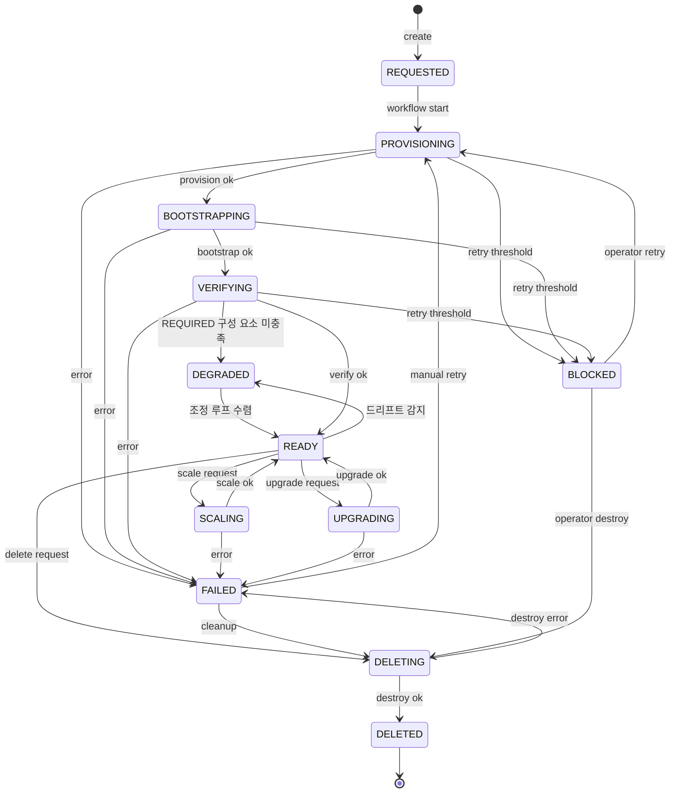

# VmCluster Workflow State Machine

VmCluster lifecycle 의 명시적 state graph + transition validation 입니다. Single source of truth 는
`VmClusterStatus.canTransitionTo(next)` 입니다.

## 1. State 정의

| State | 의미 | 카테고리 |
|-------|------|---------|
| `REQUESTED` | 생성 요청이 저장되었으며 workflow 시작 대기 상태입니다. | in-progress |
| `PROVISIONING` | Pulumi VM provision 진행 중 상태입니다 (또는 scale/upgrade). | in-progress |
| `BOOTSTRAPPING` | Bootstrap worker 가 kubeadm 구성을 진행 중입니다. | in-progress |
| `VERIFYING` | 클러스터 연결 + 등록 검증 중입니다. | in-progress |
| `READY` | 사용 가능 상태입니다. | steady |
| `DEGRADED` | Kubernetes API 는 정상이나 REQUIRED 구성 요소 일부가 미충족입니다. 조정 루프가 계속 시도합니다. | steady |
| `FAILED` | 자동 진행 중 오류가 발생했습니다 — operator 재시도 / 진단이 가능합니다. | terminal-recoverable |
| `BLOCKED` | 재시도 임계 초과 상태입니다 — operator 명시 개입이 필요합니다. | manual-only |
| `DELETING` | Pulumi destroy 진행 중입니다. | in-progress |
| `DELETED` | row 삭제 완료 상태입니다 (또는 soft-delete 표시). | **terminal** |

## 2. 정상 흐름

### Mermaid (GitHub 자동 렌더)



### ASCII fallback

```
null → REQUESTED → PROVISIONING → BOOTSTRAPPING → VERIFYING → READY
                                                                ├── SCALING ──→ READY
                                                                ├── UPGRADING → READY
                                                                └── DELETING ─→ DELETED
```

## 3. 비정상 / 복구 흐름

```
                            ┌─ (retry 임계 미만) ──┐
PROVISIONING/BOOT/VERIFY ───┤                      │
                            └─ (임계 초과) → BLOCKED ───── operator retry → PROVISIONING
                            │                              operator destroy → DELETING
                            │
                            └─ (즉시 에러) → FAILED ────── manual retry → PROVISIONING
                                                          cleanup       → DELETING
```

## 4. Full transition matrix

| From / To | REQ | PROV | BOOT | VER | READY | FAILED | BLOCKED | DELETING | DELETED |
|-----------|:---:|:----:|:----:|:---:|:-----:|:------:|:-------:|:--------:|:-------:|
| **REQUESTED**     | =  | ✓ |   |   |   | ✓ | ✓ | ✓ |   |
| **PROVISIONING**  |    | = | ✓ |   | ✓ | ✓ | ✓ | ✓ |   |
| **BOOTSTRAPPING** |    |   | = | ✓ |   | ✓ | ✓ | ✓ |   |
| **VERIFYING**     |    |   |   | = | ✓ | ✓ | ✓ | ✓ |   |
| **READY**         |    | ✓ |   |   | = | ✓ |   | ✓ |   |
| **FAILED**        | ✓  | ✓ |   |   |   | = | ✓ | ✓ |   |
| **BLOCKED**       | ✓  | ✓ |   |   |   |   | = | ✓ |   |
| **DELETING**      |    |   |   |   |   | ✓ |   | = | ✓ |
| **DELETED**       |    |   |   |   |   |   |   |   | = |

`=` 는 same-state idempotent (re-assign OK) 입니다. `✓` 는 allowed forward transition 입니다. Empty 는 forbidden 입니다.

## 5. 운영 모드

기본은 **observation mode** 입니다 — invalid transition 시 `log.warn` 만 발행하고 그대로 진행합니다.

| Mode | Behavior |
|------|----------|
| **observation** (default) | invalid transition → `log.warn` + apply |
| **strict** | invalid transition → `IllegalStateException` |

`VmClusterStateMachineProperties` + `VmClusterEntity.transitionTo` 분기 + `AdminStateMachineController`
의 runtime toggle endpoint 가 있습니다. 활성화는 운영자 결정에 따릅니다 (`anycloud.vm-cluster.state-machine.strict=true`
config 또는 admin POST).

## 6. 호출자 사용 가이드

**잘못된 예** — 직접 setter 입니다.
```java
vmCluster.setProvisioningStatus(VmClusterStatus.READY);     // 검증 우회
```

**올바른 예** — transitionTo 입니다.
```java
vmCluster.transitionTo(VmClusterStatus.READY, "workflow.ready");
```

`reason` 은 짧은 dotted string 입니다 (예: `"scale.ok"`, `"workflow.maxRetries"`). log 의 source 식별용입니다.

## 7. 회귀 보호

- `VmClusterStatusTransitionTest` — graph 의 valid / invalid case 10개 회귀 보호
- `VmClusterWorkflowStep.isStaleForStatus` — workflow message guard 와 graph 일관성을 보장합니다 (별도 enum).

## 8. 변경 절차

새 transition 추가 (또는 기존 제거) 시 다음을 수행합니다.
1. `VmClusterStatus.ALLOWED_TRANSITIONS` static block 수정
2. `VmClusterStatusTransitionTest` 에 test case 추가
3. 본 문서의 matrix + diagram 업데이트

## 9. Limitations

- **scale/upgrade 가 READY → PROVISIONING 재사용**: 별도 status (`SCALING`, `UPGRADING`) 가 명확하지만
  schema migration 이 필요합니다. 현재는 reason 으로 구분합니다 (`"scale.start"` vs `"upgrade.start"`).
- **default 는 observation mode** 입니다: invalid transition 이 즉시 차단되지 않습니다.
